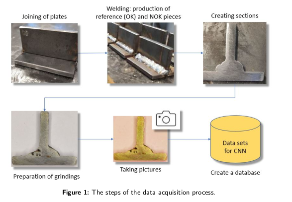
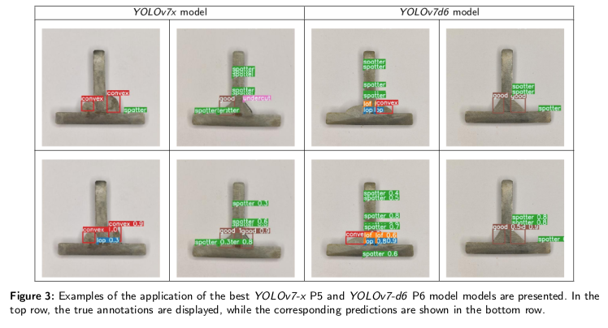

# Welding Defect Detection with YOLO algorithms on a Limited Dataset: A Comparative Study

Abstract
--------
This work focuses on detecting defects in welding seams using the most advanced YOLO
algorithms and transfer learning. To this end, we prepared a small dataset of images using manual
welding and compared the performance of the YOLO v5, v6, v7, and v8 methods after two-step
training. Key findings reveal that YOLOv7 demonstrates superior performance, suggesting its
potential as a valuable tool in automated welding quality control. Our research underscores the
importance of model selection. It lays the groundwork for future exploration in larger datasets and
varied welding scenarios, potentially contributing to defect detection practices in manufacturing
industries. The dataset and the code repository links are also provided to support our findings.

<p align="center" width="100%">
    
</p>

<p align="center" width="100%">
    
</p>

# Environment installations

For the installation [Anaconda](https://www.anaconda.com/download) is used on Ubuntu 22.04.
In command line:
```
mkdir welding
cd welding
```
## YOLOv5
In the base environment:
```
conda create --name yolov5 python=3.8 -y
conda activate yolov5
git clone https://github.com/ultralytics/yolov5
cd yolov5
pip install -r requirements.txt
```

## YOLOv7
In the base environment:
```
conda create --name yolov7 python=3.8 -y
conda activate yolov7
git clone https://github.com/WongKinYiu/yolov7.git
cd yolov7
pip install -r requirements.txt
```

## YOLOv6 and YOLOv8
In the base environment
```
conda create --name yolov8 python=3.8 -y
conda activate yolov8
git clone https://github.com/ultralytics/ultralytics yolov8
cd yolov8
pip install -e .
```

# Dataset preparations
The full dataset is available at [here](https://drive.google.com/file/d/1GrHhiCdmRnXbXEyWrLGfGGD0eS3YwDUb/view?usp=sharing).

## YOLOv5
Download, unzip the `welding_images.zip` file from the link above
which contains the images and the annotations and copy the `images` directory from it
into `yolov5/data/` and replace the original `images` directory.
Create a `labels` directory and copy the `.txt` files from `images` to in:
```
cp images/*.txt labels/.
```

Copy the `yolov5_files/autosplit_*.txt` files to the `yolov5/data` directory.

Copy the `yolov5_files/welding_data.yaml` file to the `yolov5` directory.

Copy the `yolov5_files/hyp*.yaml` files to `yolov5/data/hyps` directory.

Example training:
-----------------
```
python train.py --cos-lr --img 640 --batch 32 --epochs 200 --data welding_data.yaml --weights yolov5n.pt --project defects --name model_5n_dec4 --cache --freeze 10 
```

## YOLOv7
Copy the data directory from `yolov5` to `yolov7`:
```
cp -avr yolov5/data/images yolov7/data/images
cp yolov5/data/autosplit*.txt yolov7/data/.
```
Copy the `yolov7_files/split_datasplit.py` function to `yolov7/data` and call it by :
```
python split_dataset.py --folder images --dest images_welding
```

Copy the `yolov7_files/welding_data_v7.yaml` file to the `yolov7/data` directory.
Copy the `yolov7.yaml` and `yolov7*.yaml` configuration files from the `yolov7_files` directory to the `yolov7/cfg/training` directory.
Copy the `yolov7/utils/loss.py` file to `yolov7/utils/loss.py`.
Copy the `hyp*.yaml` ciles to `yolov7/data`.

Download from [here](https://github.com/pHidayatullah/yolov7/tree/main) 
the `yolov7*_training.pt` files and copy them to the `yolov7` directory.

Copy the `yolov7_files/train_aux.py` file and copy to `yolov7` directory. There has been added a `--freeze` argument to the parser.

Example training:
-----------------
```
python train.py --epochs 50 --workers 8 --device 0 --batch-size 4 --data data/welding_data_v7.yaml --img 640 --cfg cfg/training/yolov7_welding.yaml --weights 'yolov7_training.pt' --name yolov7-w1 --hyp data/hyp.scratch.custom.yaml --project defects --freeze 50
```

## YOLOv6 and YOLOv8
Copy the `data` directory from `yolov7` to `yolov8` (and to `yolov6`):
```
cp -avr yolov7/data yolov8/data
```

Modify the second line if the file `/home/$user/.config/Ultralytics/settings.yaml` to `yolov8` and the erase `dataset` from the end of line.

Copy the `yolov8_files/welding_data_v8.yaml` file to the `yolov8/data` directory.
Copy the `yolov6_files/welding_data_v6.yaml` file to the `yolov6/data` directory.

Example training
----------------
```
from ultralytics import YOLO
model = YOLO("yolov8n.pt")
model.train(data="./data/welding_data_v8.yaml",batch=8,imgsz=640,device=0,epochs=100,name="detect/yolov8n_1")
``` 

# Training and evaluation

The bash scripts for training and evaluation can be found in the script folder.
Just copy them to the corresponding `yolovx` directory.

Example
-------

Example two-phase training for YOLOv5 nano model.

1. Freezing the backbone and train for 200 epochs:
```
./run_training_yolov5n_p5.sh
```
2. Unfreezeing the backbone and train for 200 epochs:
```
./run_finetuning_yolov5n_p5.sh
```
3. Evaluating them on the test set:
```
./run_evaluating_yolov5n_p5.sh
```

The models and the corresponding filename endings in the `scripts` directory can be seen in the following table.

| Model             | Files               | Model             | Files               |
|-------------------|---------------------|-------------------|---------------------|
| YOLOv5n P5        | `*_yolov5n_p5.sh`   | YOLOv5n P5        | `*_yolov5n_p5.sh`   |
| YOLOv5s P5        | `*_yolov5s_p5.sh`   | YOLOv5s P5        | `*_yolov5s_p5.sh`   |
| YOLOv5m P5        | `*_yolov5m_p5.sh`   | YOLOv5m P5        | `*_yolov5m_p5.sh`   |
| YOLOv5l P5        | `*_yolov5l_p5.sh`   | YOLOv5l P5        | `*_yolov5l_p5.sh`   |
| YOLOv5x P5        | `*_yolov5x_p5.sh`   | YOLOv5x P5        | `*_yolov5x_p5.sh`   |
|                                         |                                         |
| YOLOv5n P6        | `*_yolov5n_p6.sh`   | YOLOv5n P6        | `*_yolov5n_p6.sh`   |
| YOLOv5s P6        | `*_yolov5s_p6.sh`   | YOLOv5s P6        | `*_yolov5s_p6.sh`   |
| YOLOv5m P6        | `*_yolov5m_p6.sh`   | YOLOv5m P6        | `*_yolov5m_p6.sh`   |
| YOLOv5l P6        | `*_yolov5l_p6.sh`   | YOLOv5l P6        | `*_yolov5l_p6.sh`   |
| YOLOv5x P6        | `*_yolov5x_p6.sh`   | YOLOv5x P6        | `*_yolov5x_p6.sh`   |
|                                         |                                         |
| YOLOv6n P5        | `*_yolov6n_p5.sh`   | YOLOv6n P5        | `*_yolov6n_p5.sh`   |
| YOLOv6s P5        | `*_yolov6s_p5.sh`   | YOLOv6s P5        | `*_yolov6s_p5.sh`   |
| YOLOv6m P5        | `*_yolov6m_p5.sh`   | YOLOv6m P5        | `*_yolov6m_p5.sh`   |
| YOLOv6l P5        | `*_yolov6l_p5.sh`   | YOLOv6l P5        | `*_yolov6l_p5.sh`   |


All the best finetuned models are available at here.
